```{r setup, include = FALSE}
knitr::opts_chunk$set(echo = TRUE)
knitr::opts_chunk$set(error = F)
knitr::opts_chunk$set(message = F)
options(digits = 7)

```

```{r xaringanExtra-clipboard, include = FALSE}
htmltools::tagList(
  xaringanExtra::use_clipboard(
    button_text = "<i class=\"fa fa-clipboard\"></i>",
    success_text = "<i class=\"fa fa-check\" style=\"color: #90BE6D\"></i>",
    error_text = "<i class=\"fa fa-times-circle\" style=\"color: #F94144\"></i>"
  ),
  rmarkdown::html_dependency_font_awesome()
)
```

```{r xaringan-scribble, include = FALSE}
xaringanExtra::use_scribble()
```

```{r xaringan-extra-styles, include = F}
xaringanExtra::use_extra_styles(
  hover_code_line = TRUE,         #<<
  mute_unhighlighted_code = TRUE  #<<
)
```

```{r xaringan-tile-view, include = FALSE}
xaringanExtra::use_tile_view()
```

```{r, xaringan-editable, include = F}
xaringanExtra::use_editable()
```

```{r xaringan-panelset, echo = F}
xaringanExtra::use_panelset()
```


## Tipos de estudio
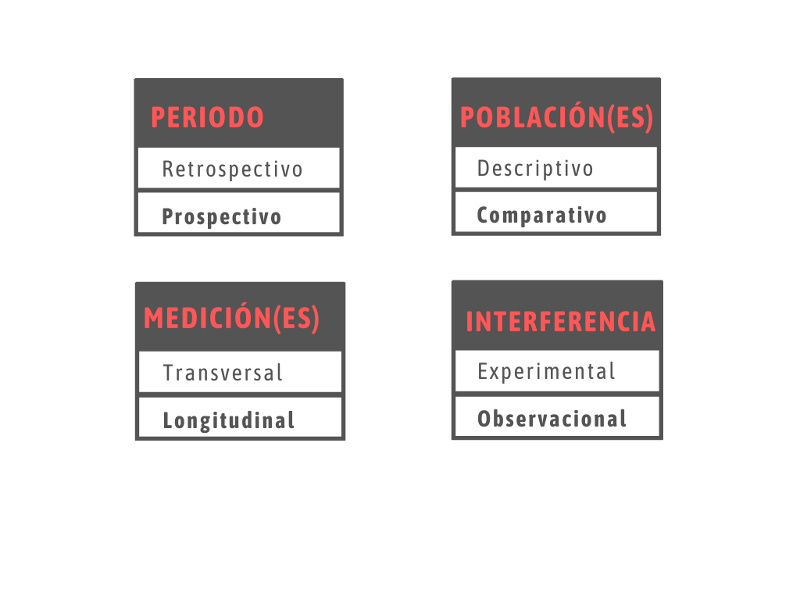

---

## Conceptos estadísticos
<center>
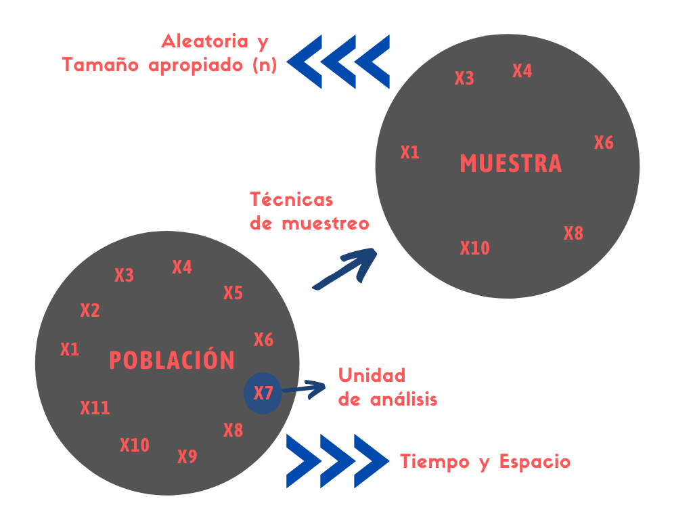
</center>

---

## Unidades de muestreo: ¿Para qué? 
<center>
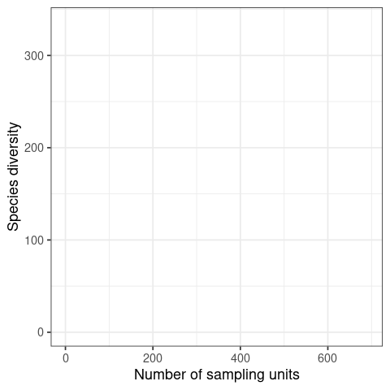
</center>


---

## Unidades de muestreo: ¿Para qué? 
<center>

</center>

---

## Tipos de variables
<center>
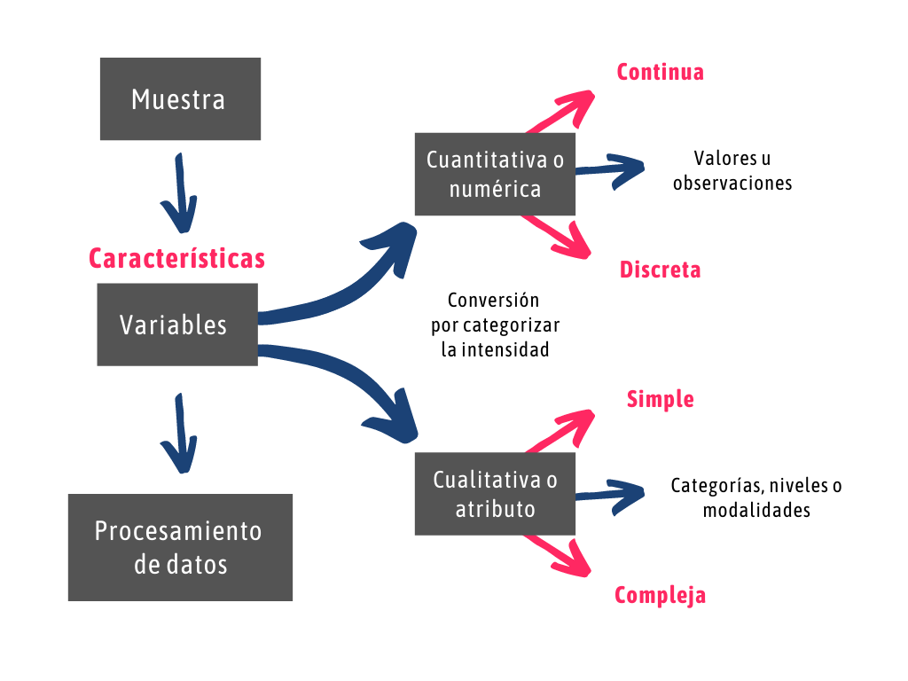
</center>

---

## Escalas de medición
<center>
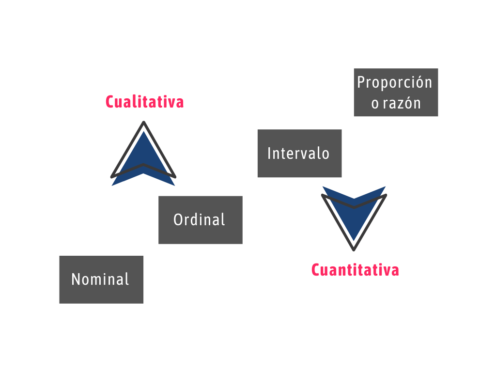
</center>


---

## Empecemos...¿Qué rayos es R?
```{r, echo = F, eval = F}
library(DiagrammeR)

pdf("diagrama.pdf")

diagrama <- mermaid("graph LR
        A(<h2> Lenguaje de <br> Programación S <br> <br> -  1976 <h/2>)-->B(<h2> Lenguaje de <br> Programación R <br> <br> -  1993 </h2>)
        B-->C(<h2> Entorno de Desarrollo <br> Integrado: RStudio  <br> <br> -  2011 </h2>)
        ")

dev.off()

```

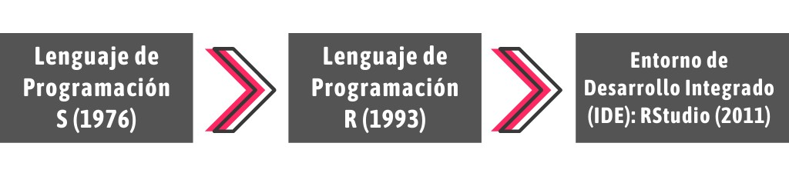
- R es considerado como un dialecto del lenguaje S 

- R fue creado por Ross Ihaka & Robert Gentleman

- Lenguaje de Programación Orientada a Objetos (POO)

- Si el objeto ya existe, su valor es borrado y reemplazado

- Operador asignación ( <- ) 

- Uso relativamente intuitivo

---

## Comunidad Comprometida

[](https://stackoverflow.com/) [](https://stats.stackexchange.com/)
[](https://www.facebook.com/groups/ecologyinr)

---

## ¿Por qué debo usar R, y no SPSS, Infostat, Past, STATA...?

- Potencial en visualización de datos (gráficos de alto impacto)

- Potencial en uso estadístico  (Frecuentista & Bayesiano)

- R resume los resultados en una línea

- R es compatible con todo (código libre y abierto)

- Comunidad comprometida

- Conexión con otros software (\Latex, Python, Julia, QGIS, MaxEnt)

- R hace de todo

---

## Paquetes 
```{r}
# 22 de diciembre 
nrow(available.packages())
```

```{r, echo = F, fig.width = 7, fig.height = 4.7, fig.align = 'center'}
library(png)
library(grid)
img  <- readPNG("images/crecimiento_paquetes.png")
grid.raster(img)
```

[Todos los Paquetes de R](https://www.rdocumentation.org/)

---

## El paquete que te soluciona la vida: **Tidyverse**
[Libro: R for Data Science (**Wickham** & Grolemund, 2017)](https://r4ds.had.co.nz/)

<p> </p>
<center>

</center>

---
class: center, middle, inverse
# Conociendo a RStudio: Workspace

---

# Atajos (Cheatsheet: [RStudio](https://drive.google.com/drive/u/0/folders/1T5eVp1UuQPDNDnNWRxe8WhtPDRF06aC9))

- Ctrl + Shift + N = Abrir Script

- Ctrl + S = Guardar Script

- Ctrl + W = Cerrar Script

- Ctrl + 1 = Ir a Script

- Ctrl + 2 = Ir a Consola

- Ctrl + L = Limpiar Consola

- Ctrl + 6 = Ir a Plots

- Ctrl + Tab = Mover entre Scripts

---

# Teoría y creación de objetos de R

R trabaja con objetos (POO), y **todos** tienen...
- **Nombre**: debe comenzar con una letra (A- Z o a-z), puede incluir letras, dígitos (0-9), y puntos (.). R discrimina entre mayúsculas y minúsculas (X y x).

```{r}
abundancia <- c(12, 12, 11, 10, 8, 23)
playas <- c("San Bartolo", "Pucusana", "Chancaíllo", "Santa Rosa", "Costa Azul", "Lurín")
```

--

- **Contenido**: Numérico o Caracteres

```{r}
abundancia
playas
```

---
- **Dimensión** (dataframe) o **longitud** (vector)

```{r}
length(abundancia)
length(playas)
```

```{r}
base_datos <- data.frame(
                        Alumnos = c("Yessica", "Juan", "Uriel"),
                        Nota = c(20, 17, 11)
                        )
base_datos
dim(base_datos)
```


---

# Estructura de datos (**clases**) en R
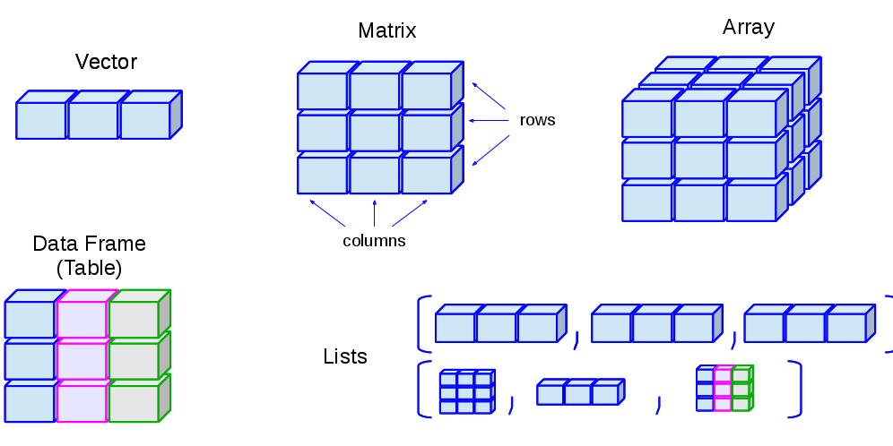
---

## Vector

```{r, echo = T}
Playas <- c("San Bartolo", "Pucusana", "Chancaíllo", "Santa Rosa", "Costa Azul", "Lurín")
class(Playas)
```

--

```{r, echo = T}
Nivel_contaminacion <- c("Saludable", "No Saludable", "Poco Saludable", "Saludable", "No Saludable", "No Saludable")
class(Nivel_contaminacion)
```

--

```{r, echo = T}
Presencia_garza <- c(T, F, T, T, F, T)
class(Presencia_garza)
```

--

```{r, echo = T}
Abundancia_garza <- c(12, 23, 10, 5, 10, 12)
class(Abundancia_garza)
```

---

## Data frame
```{r}
data <- data.frame(Playas, Nivel_contaminacion, Presencia_garza, Abundancia_garza)

data

dim(data)

class(data)

```

---

## Listas
```{r}
lista_a <- list(Playas, Nivel_contaminacion, data)
```

--

```{r}
lista_a[[1]]
```

--

```{r}
lista_a[[2]]
```

--

```{r}
lista_a[[3]]
```

---
## Listas

```{r}
lista_b <- list("Hola", Playas, "Colores") 
lista_b
```

---
## Indexación: Selección de subconjuntos 
### "Ingresar al objeto"

- Vector: [i]
```{r, echo = T, eval = F}
vector[4]
```

--

- Matrices y dataframes: [i, j]
```{r, echo = T, eval = F}
dataframe[4, 1]
```

--

- Arrays: [i, j, k]
```{r, echo = T, eval = F}
arreglo[1, 4, 9]
```

--

- Listas: [[i]]
```{r, echo = T, eval = F}
lista[[1]]
```


---
## Indexación en un Data frame
```{r}
data[1, 2]

data[3, 1]

data[3, c(1,2,3,4)]

data[3, 1:4]

```

---
### Data frame: Indexación con DataEditR
```{r}
library(DataEditR)
# DataEditR::data_edit(data)
```


---

## Resumen
<center>
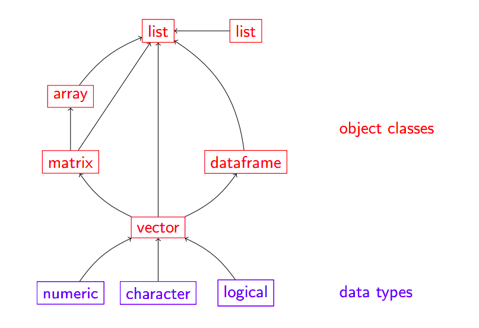
</center>

---
## Conversión y manipulación de objetos 
```{r, eval = F}
numerico <- c(1, 2, 3, 5, 67, 12, 231, 23)
numerico_2 <- c(1, 0, 1, 0, 1, 1, 1, 1)
```

--

- Convertir en caracter
```{r, eval = F}
caracter_convertido <-  as.character(numerico)
```

--

- Convertir en numérico
```{r, eval = F}
numerico_convertido <- as.numeric(caracter)
```

--

- Convertir en lógico
```{r, eval = F}
logico_convertido <- as.logical(numerico_2)
```

--

- Convertir en dataframe
```{r, eval = F}
df_convertido <- as.data.frame(numerico_2)
```

---
# Operadores lógicos 👀

```{r, echo = F}
library(kableExtra)
operadores_logicos <- data.frame(Símbolo = c("==", "!=", "<", "<=", ">", ">=", "|", "&", "!", "%in%"), Definición = c("igual", "no igual (diferente)", "menor que", "menor o igual que", "mayor que", "mayor o igual que", "o", "y", "no", "incluido en"))

kbl(operadores_logicos) %>% kable_styling(bootstrap_options = "striped", full_width = F, position = "center")

```

---

# Bases de datos
## Untidy data
<center>
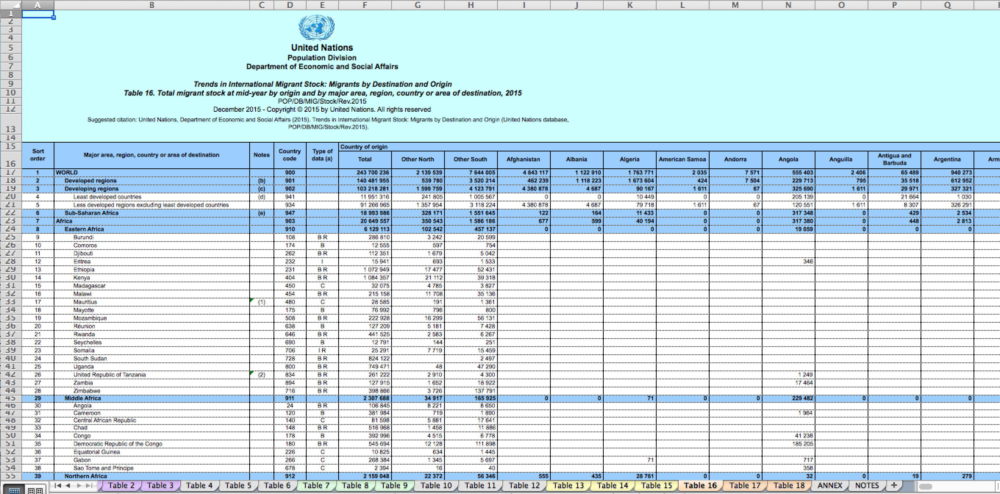

</center>


---

## Tidy data [(Wickham, 2014)](https://vita.had.co.nz/papers/tidy-data.pdf)

 - Estructura adecuada de la base de datos
 
 - Variable -> columna
 
 - Observación -> fila
 
 - Decimales deben ser puntos (se sugiere)


---
```{r, echo = F}
library(tidyverse)
library(kableExtra)
```

## ¿Será tidy?
```{r}
df1 <- data.frame(
                 nombres = c("Hormiga A", "Hormiga B", "Hormiga C", "Hormiga D"),
                 Pantanos_Villa = c(12, 22, 9, 10), 
                 Ventanilla = c(0, 7, 6, 1)
                 )
```

```{r, echo = F}
kable(df1) %>% kable_paper("striped") %>% kableExtra::kable_styling(font_size = 13)
```


---
## ¿Será tidy?
```{r}
df2 <- data.frame(
                  localidad = c("Pantanos de Villa, Ventanilla", "Pantanos de Villa, Ventanilla" ),
                  Hormiga_A = c(12, 0), 
                  Hormiga_B = c(22, 7), 
                  Hormiga_C = c(9, 6), 
                  Hormiga_D = c(10, 1)
                 )
```


```{r, echo = F}
kable(df2) %>% kable_paper("striped") %>% kable_styling(font_size = 13)
```

---
## ¿Será tidy? 
```{r, echo = F}
library(kableExtra)
```

```{r}
df3 <-  data.frame(
                  especie = c("Hormiga A", "Hormiga B", "Hormiga C", "Hormiga D", "Hormiga A", "Hormiga B", "Hormiga C", "Hormiga D"), 
                  localidad = c("Pantanos de Villa", 'Pantanos de Villa', "Pantanos de Villa", "Pantanos de Villa", "Ventanilla", 'Ventanilla', "Ventanilla", "Ventanilla"), 
                  abundancia = c(12, 22, 9, 10, 0, 7, 6, 1)
                  )
```

```{r, echo  = F}
kable(df3) %>% kable_paper("striped") %>% kable_styling(font_size = 13)
```

---
## ¿Y si no tengo ninguna data 😥?

```{r, echo = T, eval = F}
data("iris")
data("msleep")
data("trees")
data("beavers")
data("PlantGrowth")
data("InsectSprays")

library(iNEXT)
library(vegan)
data("ant")
data("spider")

# R presente en Ciencia ciudadana: 
library(rgbif)
library(rinat)
```

---

class: inverse, middle, center
# Importar bases de datos

---

### Importar en formato **CSV** (comma-separated values)
```{r, echo = T}
df <- read.csv("/home/biologisturiel/Descargas/data/data_emerita.csv",
               header = T,
               sep = ",",
               dec = ".")
```

--

```{r}
head(df, 4)
```

---

### Importar en formato Excel (xls, xlsx)
```{r, eval = F}
library(readxl)
df_excel <- read_excel('aca debe ir la dirección en donde se encuentra tu archivo, tu archivo debe acabar en xls o xlsx', sheet = "Hoja1")
```

--

### Importar un Excel Drive (Google)
```{r, eval = F}
library(gsheet)
df_excel_drive <- gsheet2tbl("https://docs.google.com/spreadsheets/d/13gV_HUqe55328loEn0XPaxxG7-pNbpZ9/edit#gid=1922099029")
```

--

### Importar archivos de más de 3GB (muy pesados)
```{r, eval = F}
library(data.table)
df_pesada <- fread("/home/biologisturiel/Descargas/data/data_emerita.csv")
```

---

### Importar del portapapeles (clipboard)
```{r, eval = F}
df_clipboard <- read.delim("clipboard")
```

--

### Importar archivos delimitados por espacios (txt) (por ejem [GBIF](https://www.gbif.org/))
```{r, eval = F}
library(data.table)
df_gbif <- fread("/home/biologisturiel/Descargas/data/occurrence.txt")
```

--

### Importar con file.choose 
```{r, eval = F}
df_aelegir <- fread(file.choose()) 
```

--

### Importar con clicks 
```{r}
# Desde RStudio
```

---

class: inverse, middle, center
# Exportar bases de datos (y resultados)

---

### Exportar en formato CSV (decimal: punto)
```{r, eval = F}
data("iris")
write.csv(iris, "df_iris_punto.csv", row.names = F, dec = ".")
```

--

### Exportar en formato CSV (decimal: coma)
```{r, eval = F}
data("iris")
write.csv(iris, "df_iris_coma.csv", row.names = F, dec = ",")
```

--

### Exportar en formato Excel (xls, xslx)
```{r, eval = F}
data("msleep")
write.xlsx(msleep, "df_msleep.xlsx")
```

---
## Comandos fundamentales para reconocer un objeto 
```{r, eval = F}
# muestra todos los objetos del environment 
ls()
# muestra los objetos acorde al patrón solicitado
ls(pat = "^m")
# estructura del objeto
str()
# remueve objeto 
rm()
# remueve todos los objetos
rm(list = ls())
# remueve objetos acorde al patrón
rm(list = ls(pat = "^m"))
# clase de objeto
class()
# filas del objeto
nrow()
# columnas del objeto
ncol()
```

---

## Comandos fundamentales para reconocer un objeto 
```{r, eval = F}
# longitud 
length()
# dimensión
dim()
# ver niveles del factor
level()
# nombres de columnas del objeto 
names()
# abrir (ver) el objeto
View()
# ver parte inicial del objeto 
head()
# ver parte final del objeto
tail()
# resumen del ob-jeto
summary()
# frecuencias absolutas del objeto
table()
# frecuencias relativas del objeto
prop.table()

```

---


## Obtención de estadísticos 
### [Data de aplicación](https://www.researchgate.net/publication/330900496_IMPLICATIONS_OF_THE_SANITARY_QUALITY_OF_BEACHES_IN_THE_PARASITIC_ECOLOGY_OF_EMERITA_ANALOGA_STIMPSON_1857_DECAPODA_HIPPIDAE)

```{r}
library(tidyverse)
glimpse(df)
```

---
### Conociendo los **niveles** de las variables independientes (factor)
```{r}
unique(df$LC)
```
--

```{r}
unique(df$NMP)
```

--
```{r}
unique(df$EST)
```

--
```{r}
unique(df$SEX)
```

---
### Valores máximos y mínimos 
```{r}
min(df$NTP)
which.max(df$NTP)
```
--

```{r}
max(df$NTP)
which.min(df$NTP)
```

--
```{r}
range(df$NTP)
c(min(df$NTP), max(df$NTP))
```

---

### Estadísticos según variable independiente (factor)
```{r}
aggregate(NTP ~ NMP, df, mean)
```

--

```{r}
aggregate(NTP ~ NMP, df, sd)
```

---

### Estadísticos según variable independiente (factor)
```{r}
library(Rmisc)
RP_lc_sex <- summarySE(df, measurevar = c("RP"), groupvars = c("LC", "SEX"))
RP_lc_sex
```

---

### Estadísticos según variable independiente (factor)
```{r}
library(Rmisc)
NTP_lc_sex <- summarySE(df, measurevar = c("NTP"), groupvars = c("LC", "SEX"))
```

---

### Redondear 
```{r}
round(NTP_lc_sex$NTP, 3)
```

--

```{r}
NTP_lc_sex[, -c(1,2)] <- round(NTP_lc_sex[, -c(1,2)], 2)
head(NTP_lc_sex, 7)
```

---

## Subsetting (filtrar, seleccionar) 
```{r, eval = F}
subset(NTP_lc_sex, select = c(LC, SEX, N, NTP, sd))
```

--

```{r}
subset(NTP_lc_sex, NTP > 3)
```

---

## Subsetting (filtrar, seleccionar) 
```{r}
subset(NTP_lc_sex, NTP == 4)
```
--

```{r}
subset(NTP_lc_sex, NTP != 4)
```

---

## Subsetting (filtrar, seleccionar) 
```{r}
subset(NTP_lc_sex, NTP %in% 5.50)
```

--

```{r}
subset(NTP_lc_sex, NTP %in% c(4, 5.50))
```

---

##  NAs (not available) y outliers (datos atípicos)
```{r}
df_na <- data.frame(abundancia = c(1, NA, NA, 2, 3, 2, 3, NA, 24, 40), localidad = c("sitio a", "sitio a", "sitio a", "sitio a", "sitio a", "sitio b", "sitio b", "sitio b", "sitio b", "sitio b"), altitud = c(760, 760, 760, 760, 760, 1090, 1090, 1090, 1090, 1090))
```

```{r}
df_na
```

---

### plot_missing: para ver los NAs por variable
```{r}
library(DataExplorer)
plot_missing(df_na)
```

---

### Eliminar NAs (tidyr)
```{r}
df_na2 <- drop_na(df_na)
df_na2
```

---

### Eliminar NAs (tidyr)
```{r}
plot_missing(df_na2)
```

---

### ¿Eliminar Outliers? **(¿cuándo?: LM, GLM; criterio)**
- Criterio para establecer límites de outliers:
  
- Rango intercuartílico (RIQ): $$Q3 - Q1$$
  
- Límite máximo: $$Q3 + 1.5 * RIQ$$
  
- Límite mínimo: $$Q1 - 1.5 * RIQ$$ 

```{r}
fivenum(df_na$abundancia)
```

---

### Recordando los estadísticos de un boxplot
```{r}
boxplot(df_na$abundancia)
```

---
### Eliminar outliers (y los que tienden a ser outliers)
```{r}
outliers <- boxplot(df_na$abundancia, plot = F)$out
outliers
```

```{r, fig.width = 3.9, fig.height = 3.9, fig.align = 'left'}
df_sin_outlier <- df_na[-which(df_na$abundancia %in% outliers), ]
boxplot(df_sin_outlier$abundancia)
```

---

class: inverse, middle, center
# Introducción al tidyverse 🤩

---

## Data de análisis
```{r}
data(msleep)

glimpse(msleep)
```


---

class: center, inverse, middle
# Pipeline: %>% (Ctrl + Shift + M)

---

## Ejemplos con pipeline
- x %>% f(y) es lo mismo que f(x, y)
- y %>% f(x, ., z) es lo mismo que f(x, y, z )

```{r, eval = F}
df_ento %>% head()
df_ento %>% tail()
df_ento %>% str()
df_ento %>% subset(NTP %in% c(23:26))
df_ento %>% view()
df_ento %>% nrow()
df_ento %>% ncol()
df_ento$FAMILIA %>% class()
df_ento$PUNTO %>% unique()
df_ento$ORDEN %>% as.factor() %>% levels()
df_ento$ORDEN %>% table() %>% prop.table()
objetos_eliminar <- c(iris, asd, ant)
objetos_eliminar %>% rm()
```

---

## Ordenando la data con gather(reunir) y spread(extender)
- Gather: Reune columans en filas
- Spread: Extiende filas en columnas

## ¿gather o spread?

```{r}
df1 <- data.frame(
  nombres = c("Hormiga A", "Hormiga B", "Hormiga C", "Hormiga D"),
  Pantanos_Villa = c(12, 22, 9, 10), 
  Ventanilla = c(0, 7, 6, 1)
)
```


```{r}
df1
```

```{r}
df1 %>% gather(key = "lugares", value = "abundancia", -nombres)
```

---

## ¿gather o spread?

```{r}
df2 <- data.frame(
  localidad = c("Pantanos de Villa, Ventanilla", "Pantanos de Villa, Ventanilla" ),
  Hormiga_A = c(12, 0), 
  Hormiga_B = c(22, 7), 
  Hormiga_C = c(9, 6), 
  Hormiga_D = c(10, 1)
)

df2
```

--

```{r}
df2_gather <- df2 %>% gather(key = "Especies", value = "abundancia", -localidad)

df2_gather_2 <- df2 %>% gather(key = "Especies", value = "abundancia", 2:5)

df2_gather_3 <- df2 %>% gather(key = "Especies", value = "abundancia", c(2, 3, 4, 5))
```

---

## Separate 

- Separa una columna en varias

```{r}
df2_separate <- df2_gather %>% separate("localidad", c("humedalA", "humedalB"), sep = ",")
```


-- 

```{r}
df2_separate
```

---

## Unite
- Une varias columnas en una 

```{r}
df2_separate %>% unite(localidad, c("humedalA", "humedalB"), sep = "-")
```

---

## Select

```{r}
msleep %>% select(order, order, sleep_total)
```

---

## Select

```{r}
msleep %>% select(3:5)
```

---

## Select

```{r}
msleep %>% select(c(5, 6, 7))
```

---

## Select

```{r}
msleep %>% select_if(is.numeric)
```

---

## Select

```{r}
msleep %>% select_if(is.character)
```

---

## Filter

```{r}
msleep %>% filter(order == "Carnivora")
```

---

## Filter

```{r}
msleep %>% filter(order != "Carnivora")
```

---

## Filter

```{r}
msleep %>% filter(order != "Carnivora")
```

---

## Filter

```{r}
msleep %>% filter(order %in% c("Carnivora", "Primates"))
```

---

## Filter

```{r}
msleep %>% filter(sleep_total >= 16)
```

---

## Filter

```{r}
msleep %>% filter(sleep_total <= 3)
```

---

## Filter

```{r}
msleep %>% filter(sleep_total %in% 15:20)
```

---

## group_by y summarise (summarize)

```{r}
msleep %>% 
  group_by(order) %>% 
  summarise(promedio = mean(sleep_total)) 
```

---

## group_by y summarise (summarize)

```{r}
msleep %>% 
  group_by(conservation, order) %>% 
  summarise(promedio = mean(sleep_total)) %>% 
  head(4)
```

---

## group_by y summarise (summarize)

```{r}
msleep %>% 
  group_by(conservation, order) %>% 
  summarise(desviacion_estandar = sd(sleep_total))
```

---

## group_by y summarise (summarize)

```{r}
msleep %>% 
  group_by(conservation, order) %>% 
  summarise(promedio = mean(sleep_total),
            desviacion_estandar = sd(sleep_total))
```

---

## group_by y summarise (summarize)

```{r}
library(plotrix)

msleep %>% 
  group_by(conservation, order) %>% 
  summarise(promedio = mean(sleep_total),
            desviacion_estandar = sd(sleep_total),
            erorr_estandar = std.error(sleep_total)) 
```

---

## group_by y summarise (summarize)

```{r}
msleep %>% 
  group_by(conservation, order) %>% 
  summarise(promedio = mean(sleep_total),
            desviacion_estandar = sd(sleep_total),
            erorr_estandar = std.error(sleep_total)) 
```

---

## mutate

```{r}
ms_sleep2 <- msleep %>% 
  select(order, genus, sleep_total) %>% 
  mutate(sueño_maximo = max(sleep_total))

ms_sleep2
```

---

## mutate

```{r}
ms_sleep2 %>% 
  select(order, genus, sleep_total, sueño_maximo) %>% 
  mutate(diferencia_sueño = sueño_maximo - sleep_total) %>% 
  head(3)
```

---

## Rename

```{r}
ms_sleep2 %>% 
  dplyr::rename(orden = order, Genero = genus, total = sleep_total, maximo = sueño_maximo)
```


---

class:center,inverse,middle
# Practica: Data de insectos


---

class: center, inverse, middle
# Dudas 🤔

---

# Pero antes...🤔
- example(): Un ejemplo de R sobre cualquier comando

- [**Swirl**](https://swirlstats.com/students.html): Paquete para aprender R <3

- help(): Pedir ayuda en R (muestra info relacionada al comando)

- Stackoverflow: Comunidad comprometida

- Cheatsheet: [Basic](https://www.rstudio.com/wp-content/uploads/2016/10/r-cheat-sheet-3.pdf); [Dplyr](https://www.rstudio.com/wp-content/uploads/2015/02/data-wrangling-cheatsheet.pdf); [ggplot2](https://www.rstudio.com/wp-content/uploads/2015/03/ggplot2-cheatsheet.pdf)

---

class: center, inverse, middle
# Fin 👨‍💻

---
class: center, inverse, middle
# Análisis de la diversidad biológica 🐜🐚🦇🦁

---

## ¿Biodiversidad o diversidad biológica?: [Origen del término](https://academic.oup.com/bioscience/article-abstract/71/9/893/6312537)
<center>
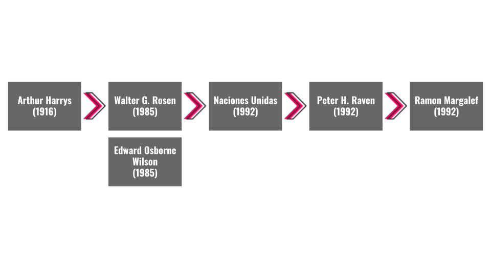
</center>

---

## Escalas de estudio
<center>
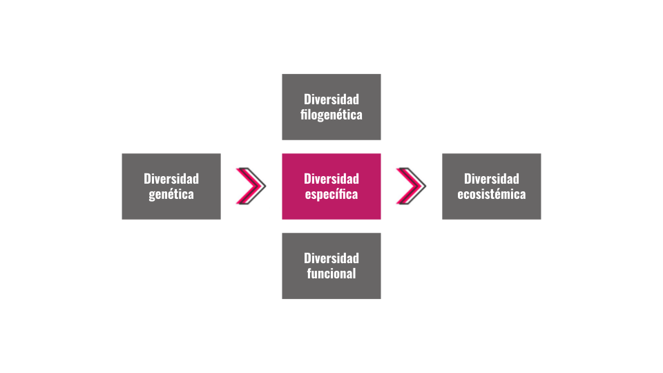
</center>

---

## Componentes y escalas de la diversidad específica
<center>
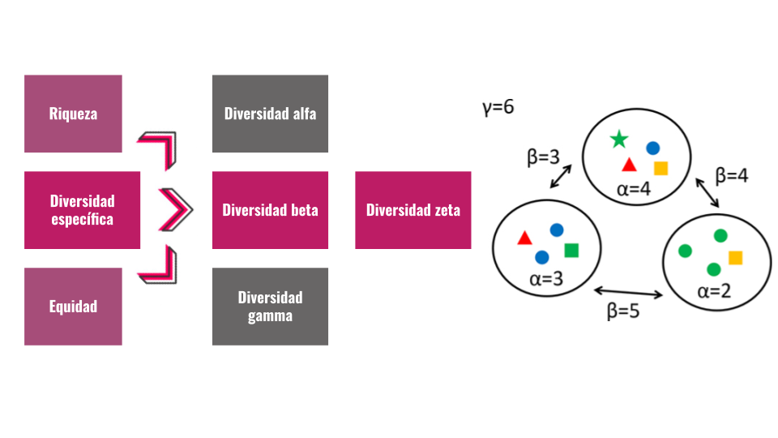
</center>

---

## Diversidad: alfa, beta, gamma
<center>
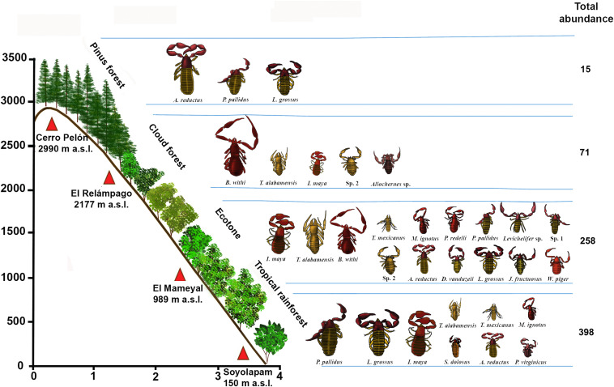
</center>

---

## Diversidad: alfa, beta, gamma
<center>
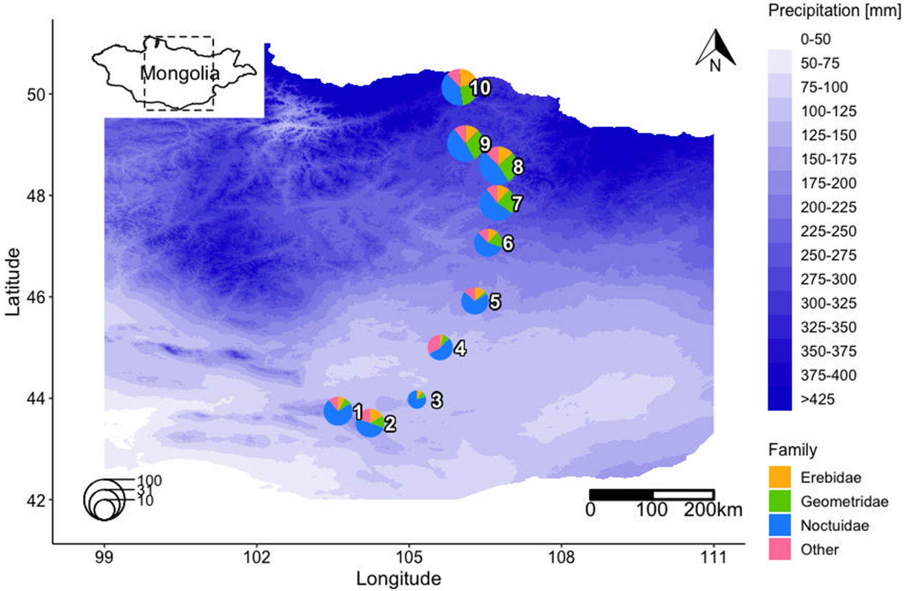
</center>

---

## Diversidad: alfa, beta, gamma
<center>
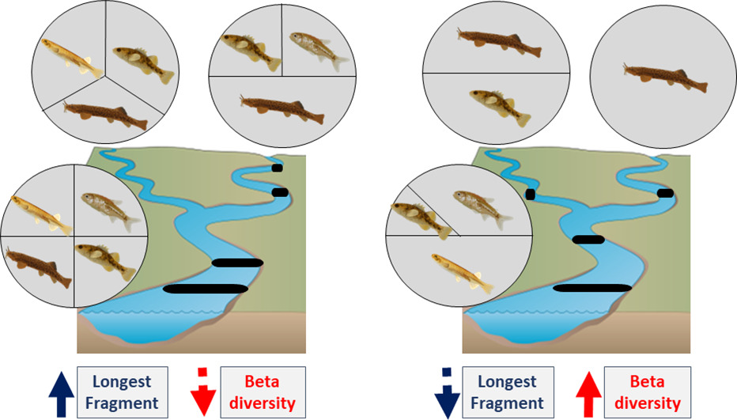
</center>

---

## Diversidad: alfa, beta, gamma
<center>
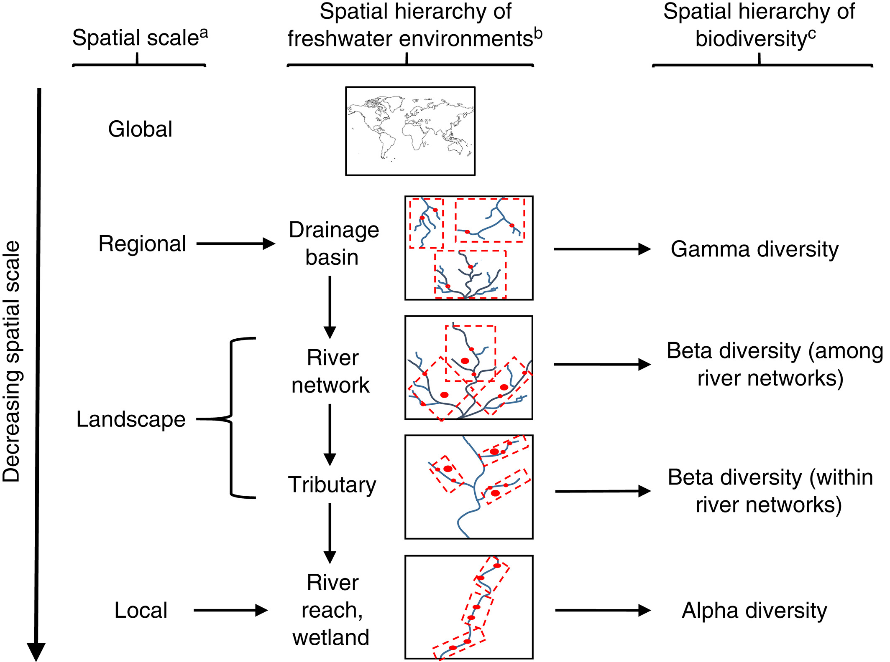
</center>

---

class:center, inverse, middle
# ¿Por qué se ha insistido tanto en cuantificar el valor de importancia de cada especie?
# ¿Por qué considerar a una comunidad más equitativa como una comunidad más diversa?
# Número de especies, distribución de la abundancia, dominancia de especies 
---

## ¿Qué comunidad es más diversa?
<center>
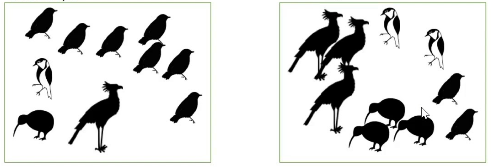
</center>

---

## ¿Qué comunidad es más diversa?
<center>
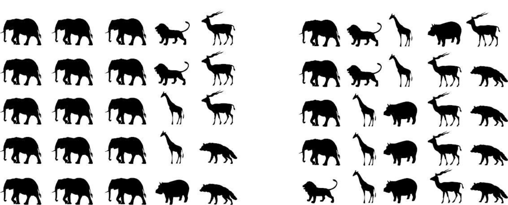
</center>

---

## Principios básicos para medir la diversidad biológica

- Expertis en la determinación taxonómica (infraespecífico)

- Diseño ecológico adecuado

- Réplicas de cada muestra (evitar las [pseudoréplicas](https://esajournals.onlinelibrary.wiley.com/doi/10.2307/1942661)) 
- Índice de diversidad más medida de dispersión (iNEXT)

- La intensidad de muestreo puede variar, pero el método de colecta no. 

- Tipos de hábitat donde se obtienen las muestras deben ser similares.

---

## Medición de la diversidad alfa ([Moreno](http://entomologia.rediris.es/sea/manytes/metodos.pdf), 2003)
<center>
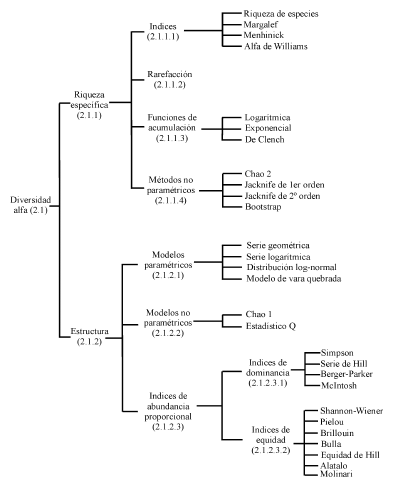
</center>

---

## 1) Riqueza específca: 1.1) índices, 1.2) rarefacción, 1.3) funciones de acumulación, 1.4) métodos no paramétricos
## 1.1.1) Riqueza de especies (S)
```{r}
sp1 <- c(5, 0, 0, 0, 0, 0, 0, 0, 0, 0)
sp2 <- c(0, 0, 0, 0, 0, 29, 0, 0, 0, 0)
sp3 <- c(0, 0, 0, 0, 6, 12, 21, 0, 0, 0)
sp4 <- c(65, 25, 6, 0, 0, 0, 0, 0, 60, 72)
sp5 <- c(5, 39, 42, 0, 0, 0, 0, 13, 47, 34)
sp6 <- c(0, 0, 0, 0, 0, 0, 5, 0, 0, 0)
sp7 <- c(0, 6, 6, 0, 0, 0, 0, 6, 4, 0)
sp8 <- c(0, 23, 31, 40, 34, 0, 0, 37, 0, 0)
sp9 <- c(0, 0, 0, 0, 18, 22, 20, 0, 0, 0)
sp10 <- c(0, 0, 0, 14, 12, 0, 0, 0, 0, 0)
sitios <- c("sitio1", "sitio2", "sitio3", "sitio4", "sitio5", "sitio6", "sitio7", 
    "sitio8", "sitio9", "sitio10")
datadiversidad <- data.frame(sitios, sp1, sp2, sp3, sp4, sp5, sp6, sp7, sp8, sp9, 
    sp10)

```

---

## Riqueza de especies (S)
```{r}
df_peces <- read.csv("/home/biologisturiel/Descargas/data/data_peces.csv")

lagunas <- df_peces$Especies

df_peces_2 <- as.data.frame(t(df_peces[,-1]))

colnames(df_peces_2) <- lagunas

df_peces_2$lagunas <- factor(row.names(df_peces_2))

glimpse(df_peces_2) 

```

---

## Riqueza de especies (S)

```{r}
S <- apply(df_peces_2[,-8] > 0, 1, sum)

S
```

--

```{r}
library(vegan)
specnumber(df_peces_2[, -8])
```

---
## Índice de diversidad de Margalef
$$
D_{MG}=\frac{S - 1}{ln(N)}
$$

--

```{r}
N <- apply(df_peces_2[, -8], 1, sum)

margalef <- (S-1)/log(N)

margalef
```

---
## Índice de diversidad de Menhinick
$$
D_{Mn}=\frac{S}{\sqrt(N)}
$$
--

```{r}
menhinick <- S/sqrt(N)
menhinick
```

---

## Ploteando la riqueza de especies (S)
```{r}
alpha <- cbind(lagunas = df_peces_2$lagunas, riqueza = S, margalef = margalef, menhinick = margalef)

rownames(alpha) <- NULL

alpha_2 <- alpha %>% as.data.frame()
```

--

```{r}
alpha_2
```

---

## Ploteando los índices de diversidad alfa

```{r}

riqueza_especifica <- expression(paste("Riqueza específica ", italic("S")))

library(ggthemes)

plot_riqueza <- ggplot(data = alpha_2, mapping = aes(x = lagunas, y = S, colour = as.factor(lagunas))) + 
  geom_point(size = 2) +
  theme_bw() +
  xlab("Lagunas") + 
  ylab(riqueza_especifica) + 
  labs(colour = "Lagunas") + 
  scale_x_continuous(breaks = seq(1, 6, by = 1)) + 
  theme(legend.position = "none")

```

---

## Obtener la clasificación taxonómica de las especies encontradas

```{r}
library(taxize)
# taxonomia <- tax_name(query = (df_peces$Especies), get = c("class", "order", "family", "genus"), db = "itis")

# df_peces_taxonommia <- cbind(taxonomia, df_peces)

df_peces_taxonomia2 <- read.csv("/home/biologisturiel/Descargas/df_peces_taxonommia.csv")

df_peces_taxonomia3 <- df_peces_taxonomia2 %>% 
mutate(sumVar = rowSums(select(., contains("laguna")))) %>% 
  select(class, order, family, genus, query, sumVar)

```


---

## Ploteando el número de especies por nivel taxonómico
```{r}
library(metacoder)

metacoder <- parse_tax_data(df_peces_taxonomia3, class_cols = c(1:5), named_by_rank = TRUE)

plot_metacoder <- metacoder %>% 
    filter_taxa(taxon_ranks != "specificEpithet") %>% 
  filter_taxa(!is.na(taxon_names)) %>% 
  filter_taxa(taxon_names == "Teleostei", subtaxa = TRUE) %>%
  filter_taxa(taxon_ranks == "order", n_subtaxa < 8, subtaxa = TRUE, supertaxa = T) %>%
  heat_tree(node_label = taxon_names, node_color = n_obs, node_size = n_obs, node_color_axis_label = "", initial_layout = "re", layout = "da")

```

---

## Plots de abundancia relativa

```{r}
library(gsheet)
data_ento <- gsheet2tbl('https://docs.google.com/spreadsheets/d/13gV_HUqe55328loEn0XPaxxG7-pNbpZ9/edit#gid=1922099029')

data_ento_2 <- data_ento %>% select(PUNTO, ORDEN, FAMILIA, ABUNDANCIA) 

data_ento_3 <- data_ento_2 %>% mutate(Comunidad = 
                ifelse(grepl("T", PUNTO), "Totoral", 
                ifelse(grepl("J", PUNTO), "Juncal", 
                ifelse(grepl("G", PUNTO), "Gramadal", "Otro"))))


totoral_relativo <- data_ento_3 %>% filter(Comunidad == "Totoral") %>% as.data.frame()

juncal_relativo <- data_ento_3 %>% filter(Comunidad == "Juncal") %>% as.data.frame()

gramadal_relativo <- data_ento_3 %>% filter(Comunidad == "Gramadal") %>% as.data.frame()
```


---

## Plots de abundancia relativa

```{r}
library(DataExplorer)
#plot_missing(totoral_relativo)
#plot_missing(juncal_relativo)
#plot_missing(gramadal_relativo)

totoral_relativo <- drop_na(totoral_relativo)
juncal_relativo <- drop_na(juncal_relativo)
gramadal_relativo <- drop_na(gramadal_relativo)


data_porcentaje_totoral <- totoral_relativo %>% 
  mutate(total = sum(totoral_relativo[1:60, 4]), porc = (ABUNDANCIA/total)*100)

data_porcentaje_juncal <- juncal_relativo %>% mutate(total = sum(juncal_relativo[1:74, 4]), porc = (ABUNDANCIA/total)*100)

data_porcentaje_gramadal <- gramadal_relativo %>% mutate(total = sum(gramadal_relativo[1:58, 4])) %>% mutate(porc = (ABUNDANCIA/total)*100)

data_ento_porc <- rbind(data_porcentaje_totoral, data_porcentaje_juncal, data_porcentaje_gramadal)
```

---

## Plots de abundancia relativa

```{r}
library(ggsci)

plot_barras_frec_relativo <- ggplot(data = data_ento_porc, mapping = aes(x = FAMILIA, y = porc, fill = ORDEN)) + 
  geom_col() + 
  coord_flip() + 
  facet_wrap(.~Comunidad, scales = "free") + 
  theme_bw() + 
  xlab("Familias") + 
  ylab("Frecuencia relativa") + 
  labs(fill = "Orden") + 
  scale_fill_npg() 

```

---

## Ordenando data para rarefacción
```{r}
data_ento_porc2 <- data_ento_porc %>% distinct()

data_ento_porc_3 <- data_ento_porc2 %>% spread(key = ORDEN, value = ABUNDANCIA)

data_ento_porc_3[is.na(data_ento_porc_3)] <- 0
data_ento_porc_3

```
--
  
```{r}
data_gramadal <- data_ento_porc_3 %>% filter(Comunidad == "Gramadal") %>% select_if(is.numeric) %>% select(-total, -porc)
data_gramadal_2 <- colSums(data_gramadal) 

data_juncal <- data_ento_porc_3 %>% filter(Comunidad == "Juncal") %>% select_if(is.numeric) %>% select(-total, -porc)
data_juncal_2 <- colSums(data_juncal)

data_totoral <- data_ento_porc_3 %>% filter(Comunidad == "Totoral") %>% select_if(is.numeric) %>% select(-total, -porc)
data_totoral_2 <- colSums(data_totoral)

```

---

## Ordenando data para rarefacción
```{r}
nombres_comunidades <- c("Gramadal", "Juncal", "Totoral")
df_inext <- rbind(data_gramadal_2, data_juncal_2, data_totoral_2)
rownames(df_inext) <- nombres_comunidades

df_inext

df_inext2 <- t(df_inext)

df_inext2
```

---


## Curvas de rarefacción con iNEXT
```{r}
library(iNEXT)
salida_iNEXT <- iNEXT(df_inext2, q = 0, datatype = "abundance", size = NULL, knots = 40, se = T, conf = 0.95, endpoint = 400, nboot = 50)

m <- c(1:500, by = 10)

salida_iNEXT_2 <- iNEXT(df_inext2, q = 0, datatype = "abundance", knots = 40, se = T, conf = 0.95, endpoint = 400, nboot = 50, size = m)

```

---

## Riqueza específica, índice de dominancia, índice de equidad con iNEXT
```{r}
ChaoRichness(df_inext2, datatype = "abundance", conf = 0.95)
ChaoSimpson(df_inext2, datatype = "abundance", conf = 0.95)
ChaoShannon(df_inext2, datatype = "abundance", conf = 0.95)
```


---

class: center, inverse, middle
# Fin 👨‍💻


